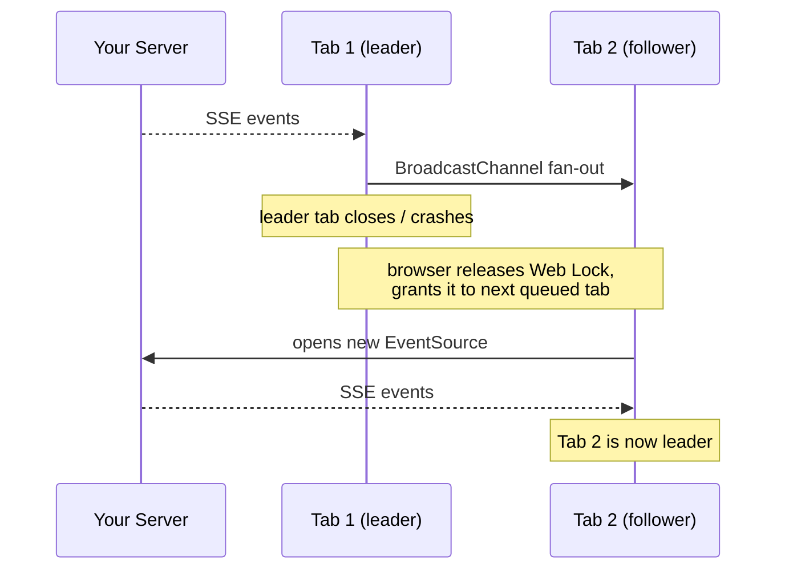

# sse-coordinator

[](https://www.npmjs.com/package/sse-coordinator)
[](https://bundlephobia.com/package/sse-coordinator)
[](./LICENSE)
[](https://www.typescriptlang.org/)
[](https://stackblitz.com/github/john-athan/sse-coordinator/tree/main/examples/demo)

Share a single SSE connection across all browser tabs using BroadcastChannel leader election.

**[▶ Try the live demo](./examples/demo)** — run it in 2+ tabs and watch one become leader (see [demo notes](./examples/demo#readme) — cross-tab coordination needs the same origin).

## The Problem

Browsers limit HTTP/1.1 connections to 6–8 per domain. Each tab opening its own `EventSource` exhausts this pool — 10 tabs means 10 SSE connections, blocking all other requests to your API. Past the cap, new requests fail with `net::ERR_INSUFFICIENT_RESOURCES` (Chrome) or simply hang.

```
WITHOUT sse-coordinator              WITH sse-coordinator
Tab 1 ──SSE──▶ \                     Tab 1 ──SSE──▶ Your Server
Tab 2 ──SSE──▶  \  6-connection      Tab 2 ──┐
Tab 3 ──SSE──▶   } browser cap       Tab 3 ──┤ BroadcastChannel
Tab 4 ──SSE──▶   } reached —         Tab 4 ──┘ (0 extra connections)
Tab 5 ──SSE──▶  /  other API
Tab 6 ──SSE──▶ /   requests BLOCKED  1 connection total, always
```

## The Solution

`sse-coordinator` elects one tab as the **leader**. Only the leader holds an `EventSource` connection. All other tabs receive events via the [BroadcastChannel API](https://developer.mozilla.org/en-US/docs/Web/API/BroadcastChannel) — zero extra connections.

```
Tab 1 (LEADER) ──── EventSource ────▶ Your Server
Tab 2 (follower) ◀──┐
Tab 3 (follower) ◀──┤── BroadcastChannel
Tab 4 (follower) ◀──┘
```

When the leader tab closes or crashes, a follower automatically promotes itself and opens a new connection — no heartbeats, no gap:



## Install

```bash
npm install sse-coordinator
# or
bun add sse-coordinator
# or
pnpm add sse-coordinator
```

## Usage

```ts
import { SSECoordinator } from 'sse-coordinator';

const coordinator = new SSECoordinator();

coordinator.connect({
  url: 'https://api.example.com/events/stream',
  eventTypes: ['notification.created', 'job.completed'],

  onEvent(event) {
    console.log(event.type, event.data);
  },

  onConnectionChange(connected) {
    console.log('connected:', connected);
  },

  onError(error) {
    console.error('SSE error:', error);
  },
});

// Later:
coordinator.disconnect();
```

## API

### `new SSECoordinator()`

Creates a coordinator instance. Each tab should create its own instance.

### `coordinator.connect(options)`

Starts the coordinator. The tab will either become leader (opening an `EventSource`) or follower (listening via `BroadcastChannel`).

| Option | Type | Required | Default | Description |
|---|---|---|---|---|
| `url` | `string` | ✓ | — | SSE endpoint URL |
| `eventTypes` | `string[]` | ✓ | — | Named event types to listen for |
| `onEvent` | `(event: SSEEvent) => void` | ✓ | — | Called for every SSE event |
| `channelName` | `string` | | `'sse-coordinator'` | BroadcastChannel name — must match across tabs |
| `withCredentials` | `boolean` | | `false` | Pass cookies with the EventSource request |
| `parseJson` | `boolean` | | `true` | `JSON.parse` event data; set `false` to receive the raw string (plain-text/custom streams) |
| `maxReconnectAttempts` | `number` | | `10` | Max reconnection attempts before calling `onError` (and, unless `reconnectForever`, giving up) |
| `reconnectForever` | `boolean` | | `false` | Keep retrying at the capped interval after `maxReconnectAttempts` instead of giving up. `onError` still fires once when the cap is reached |
| `lastEventIdParam` | `string` | | none | Query param to carry the last event id on reconnect/handover so a cooperating server can resume the stream |
| `logger` | `Logger` | | none | Optional logger (`{ debug, info, warn, error }`) |
| `onError` | `(error: Error) => void` | | — | Called when max reconnections are exceeded |
| `onConnectionChange` | `(connected: boolean) => void` | | — | Called when the leader's connection opens or closes |

### `coordinator.disconnect()`

Closes the connection and BroadcastChannel. If this tab is the leader, it releases the leader lock so a queued tab is promoted automatically.

### `coordinator.isLeader()`

Returns `true` if this tab currently holds the `EventSource` connection.

### SSEEvent

```ts
interface SSEEvent {
  type: string;
  data: unknown;
  id: string;
  timestamp: string; // ISO 8601
}
```

## How It Works

1. **Leader election** — on `connect()`, every tab requests the same named lock via the [Web Locks API](https://developer.mozilla.org/en-US/docs/Web/API/Web_Locks_API). The browser grants it to exactly one tab, which becomes leader and opens the `EventSource`. The rest queue.
2. **Event fan-out** — the leader publishes each SSE event over a `BroadcastChannel`; followers receive them with zero extra connections.
3. **Failover** — when the leader tab closes *or crashes*, the browser releases the lock and grants it to the next queued tab, which promotes itself automatically. No heartbeats, no timeouts.
4. **Reconnection** — the leader reconnects with exponential backoff (capped at 30 seconds) up to `maxReconnectAttempts` (or forever, with `reconnectForever`).
5. **Focus / online recovery** — when the tab regains focus (`visibilitychange`) or the network returns (`online`), the leader immediately revives a dead connection, resetting the backoff. This recovers from frozen background tabs and machine sleep, where the backoff timer is throttled or has already given up.
6. **Standalone fallback** — if the Web Locks API is unavailable, coordination is impossible, so each tab runs its own `EventSource` and logs a warning. Functionality is preserved; the shared-connection optimization is not.

## Multiple Apps on the Same Domain

If you run multiple independent apps on the same domain, give each a unique `channelName`:

```ts
coordinator.connect({
  url: '...',
  eventTypes: [...],
  channelName: 'my-app-sse',
  onEvent: () => {},
});
```

## vs SharedWorker / Service Worker

You can also share a connection from a `SharedWorker` or `ServiceWorker`, but:

| | `sse-coordinator` | SharedWorker | ServiceWorker |
|---|---|---|---|
| Setup | one import, no extra file | separate worker file + bundler config | separate file + registration + scope |
| Safari support | ✓ | ✗ (no SharedWorker) | ✓ |
| Runs your app code | yes — leader is a real tab with full app context | no — isolated worker scope | no — isolated, can be killed anytime |
| Survives all tabs closing | no (intentional — nothing to receive) | no | yes (but unreliable lifetime) |
| Failover | automatic via Web Locks | manual | manual |

If you need a connection that outlives every tab, use a ServiceWorker. For sharing one SSE stream **across open tabs** with the least friction, this library.

## FAQ / Symptoms

**Seeing `net::ERR_INSUFFICIENT_RESOURCES` or requests that hang once several tabs are open?**
You've hit the browser's per-domain connection cap (6–8 on HTTP/1.1). Each `EventSource` holds one slot for its whole lifetime. This library collapses all tabs down to a single connection — see [The Problem](#the-problem).

**Why do my SSE events arrive twice / N times?**
Every tab opened its own `EventSource`. Route them through one coordinator so a single leader connection fans out over `BroadcastChannel`.

**Does this work over HTTP/2 or HTTP/3?**
HTTP/2 multiplexes streams so the 6-connection limit is far less painful, but a connection per tab still costs server resources (open streams, auth, backend fan-out). Sharing one stream still helps; on HTTP/1.1 it's essential.

**What happens when the last tab closes?**
The connection closes. There's no tab left to receive events — by design. The next tab to open becomes leader and reconnects.

## Browser Support

Requires the [BroadcastChannel API](https://caniuse.com/broadcastchannel) and the [Web Locks API](https://caniuse.com/mdn-api_lockmanager) — both available in Chrome 69+, Firefox 96+, Safari 15.4+, and Edge 79+. Where the Web Locks API is missing, the coordinator falls back to one `EventSource` per tab (see "How It Works" → Standalone fallback). `crypto.randomUUID()` is used when present, with a `Math.random()` fallback otherwise.

## License

MIT

---

Made by [Pareo](https://pareo.ai)
